[![Contribuidores][contributors-shield]][contributors-url]
[![Forks][forks-shield]][forks-url]
[![Stargazers][stars-shield]][stars-url]
[![Issues][issues-shield]][issues-url]
[![MIT License][license-shield]][license-url]
[![LinkedIn][linkedin-shield]][linkedin-url]

<br />
<p align="center">
  <a href="https://github.com/robsonsilv4/carros">
    
  </a>

  <h3 align="center">Carros, sim, simplesmente carros 😄.</h3>

  <p align="center">
    Aplicação de gerencimento de carros desenvolvida para estudos.
  </p>
</p>

## Tabela de conteúdos

- [Sobre o projeto](#sobre-o-projeto)
  - [Tecnologias utilizadas](#tecnologias-utilizadas)
- [Guia inicial](#guia)
  - [Como executar o projeto](#como-executar-o-projeto)
  - [Como gerar os instaladores](#como-gerar-os-instaladores)
- [Contributing](#contributing)
- [Lecença](#licença)
- [Contato](#contato)
- [Conhecimentos adquiridos](#conhecimentos-adquiridos)

## Sobre o projeto

|                           |                           |                           |                           |                           |
| :-----------------------: | :-----------------------: | :-----------------------: | :-----------------------: | :-----------------------: |
| 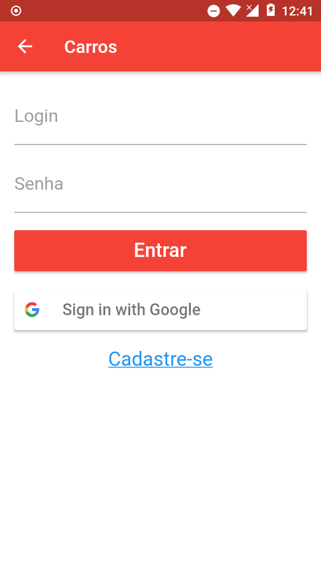 | 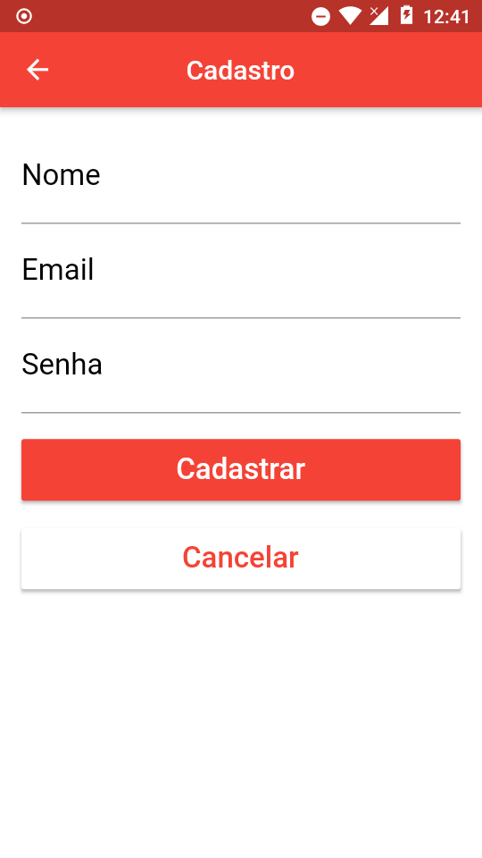 |  | 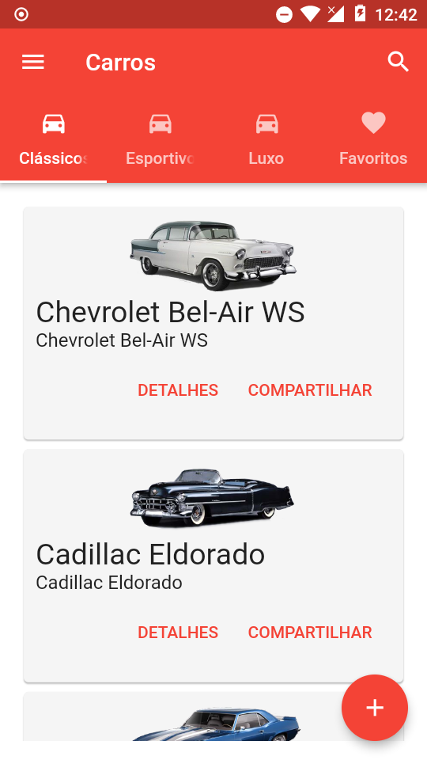 | 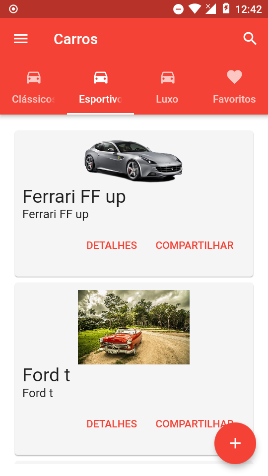 |
| 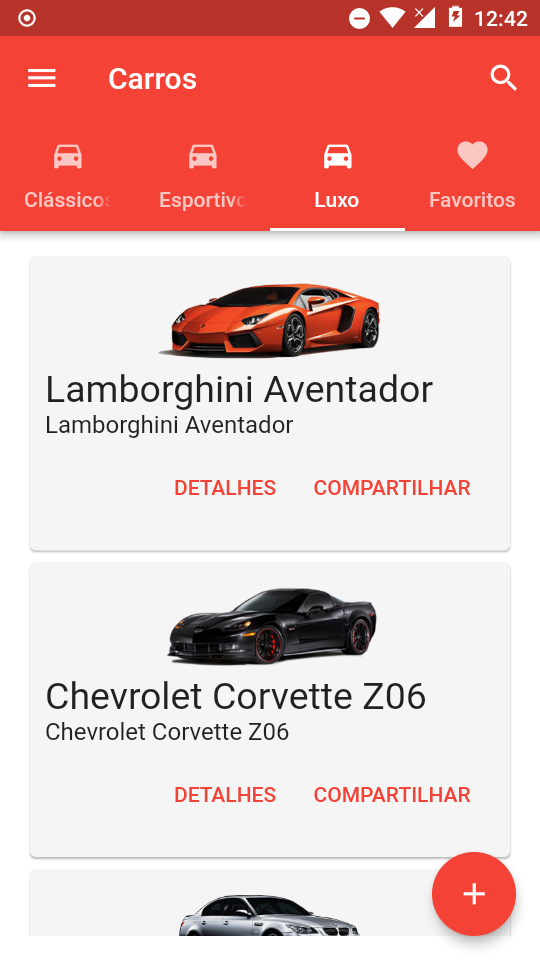 | 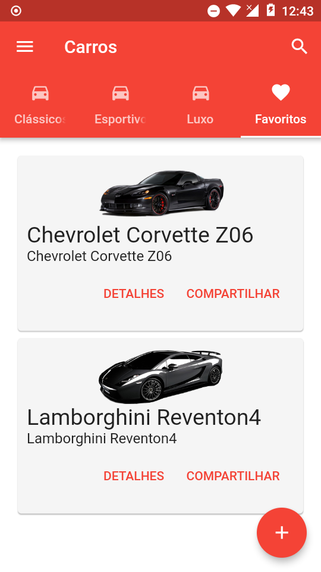 | 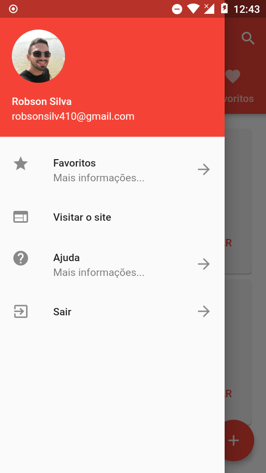 | 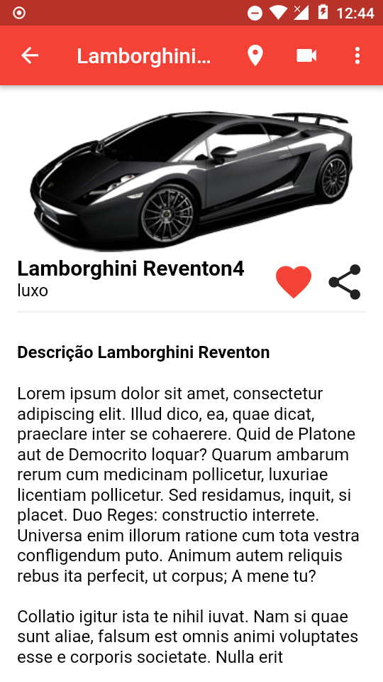 | 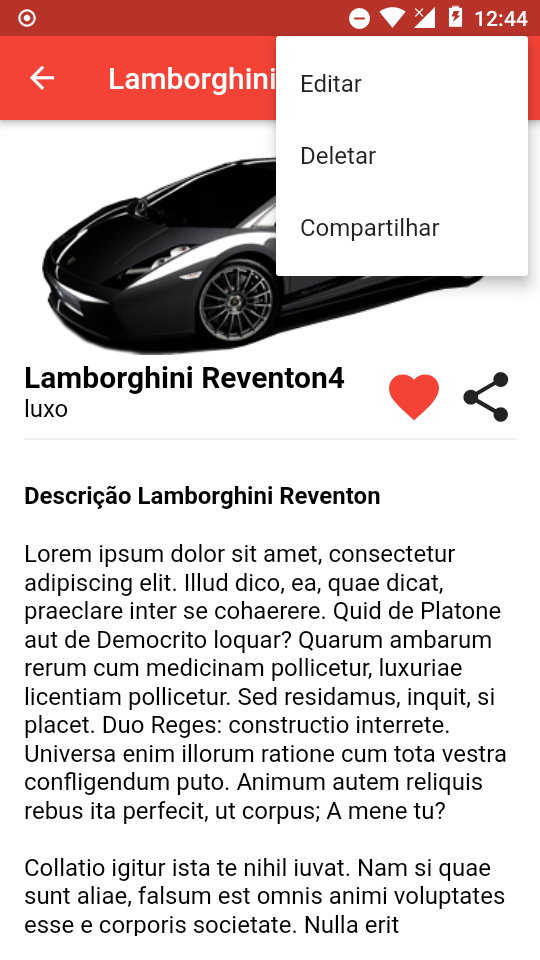 |
| 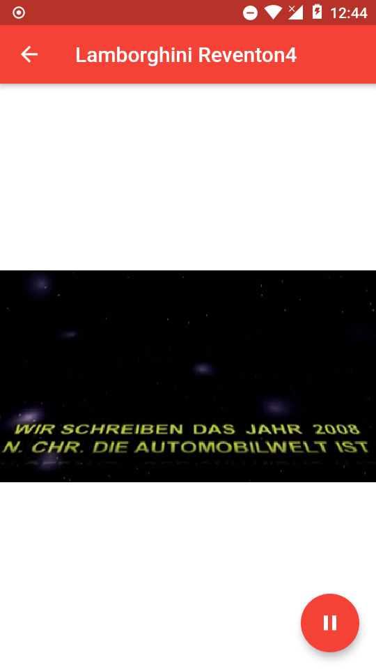 | 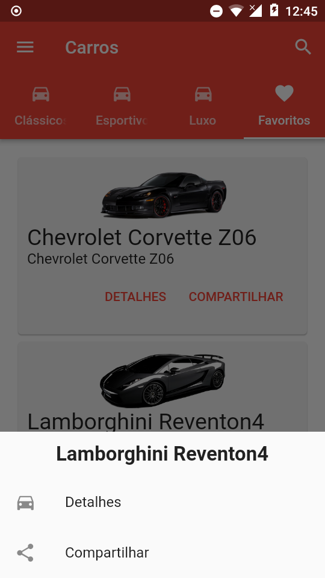 | 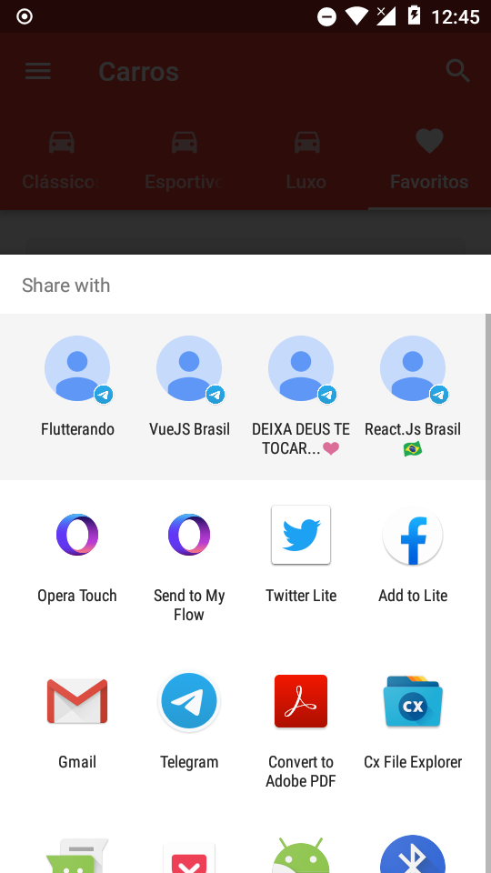 | 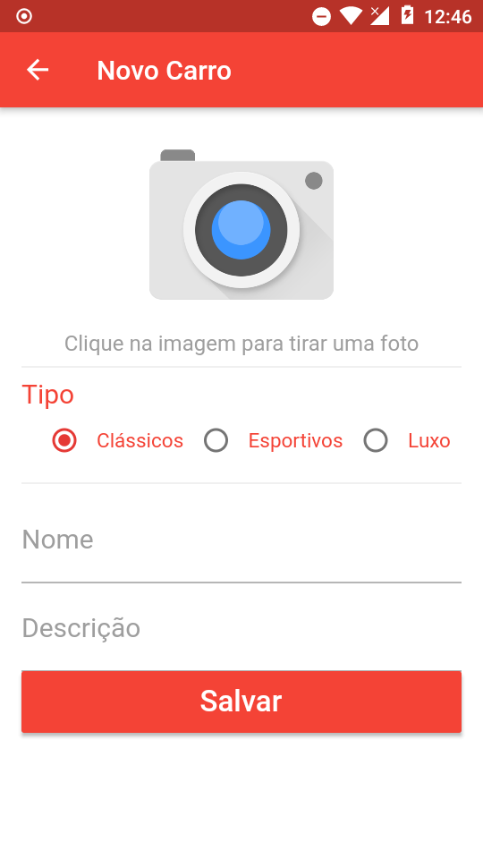 | 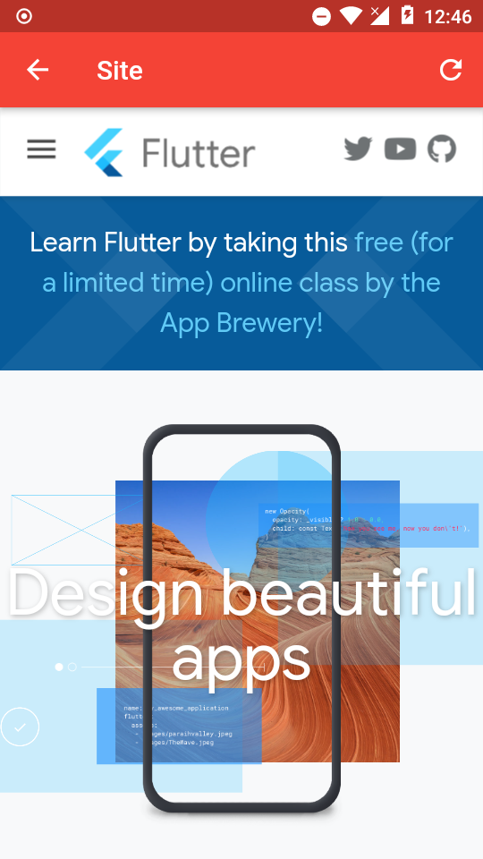 |
|                           |                           |                           |                           |                           |

Essa é uma aplicação de gerenciamento de carros desenvolvida com Flutter para estudos durante o curo [Flutter Essencial](https://www.udemy.com/course/flutter-essencial/) do Ricardo Lecheta e engloba vários conceitos e bibliotecas importantes para o ecossistema.

### Tecnologias utilizadas

Essa a lista com todos as tecnologias, pacotes e ferramentas utilizadas no projeto e ao longo do curso. Na seção de conhecimentos adquiridos eu adicionei alguns aprendizados, bem como um resumo simplificado do curso.

- [Dart](https://dart.dev/) como linguagem principal.
- [Flutter](https://flutter.dev/) como framework cross plataform.
- [connectivity](https://github.com/flutterchina/dio) para verificação de conexão.
- [http](https://github.com/flutterchina/dio) para requisições http.
- [cached_network_image](https://github.com/flutterchina/dio) para guardar imagens em cache.
- [shared_preferences](https://github.com/flutterchina/dio) para armazenamento de informações locais.
- [sqflite](https://github.com/flutterchina/dio) como banco de dados local.
- [image_picker](https://github.com/flutterchina/dio) para captura e seleção de imagens.
- [share](https://github.com/flutterchina/dio) para compartilhamento.
- [url_launcher](https://github.com/flutterchina/dio) para abrir links e aplicações.
- [video_player](https://github.com/flutterchina/dio) para reprodução de vídeos.
- [google_maps_flutter](https://github.com/flutterchina/dio) para requisição web.
- [flutter_auth_buttons](https://github.com/flutterchina/dio) para utilização de botões como do Google.
- [firebase_auth](https://github.com/flutterchina/dio) para autenticação utilizando o Firebase.
- [google_sign_in](https://github.com/flutterchina/dio) para autenticação utilizando o Google e Firebase.
- [cloud_firestore](https://github.com/flutterchina/dio) para armazenamento de dados em tempo real.
- [firebase_messaging](https://github.com/flutterchina/dio) para o envio de notificações.
- [firebase_remote_config](https://github.com/flutterchina/dio) para armazenamento de configurações.
- [firebase_storage](https://github.com/flutterchina/dio) para armazenamento de arquivos.
- [webview_flutter](https://github.com/flutterchina/dio) para carregamento de páginas web.
- [local_auth](https://github.com/flutterchina/dio) para autenticação utilizando digital.

## Como executar o projeto

Primeiro você precisa clonar o repositório:

```sh
git clone https://github.com/robsonsilv4/carros.git
```

Agora basta entrar na pasta do projeto e baixar os pacotes:
aprendizados

````

Após isso, basta executar no seu dispositivo ou emulador:

```sh
flutter run
````

## Como gerar os instaladores

Para gerar os instaladores, basta entrar na pasta do projeto e executar o seguinte comando:

```sh
flutter build apk --split-per-abi

flutter install # para instalar no dispositivo ou emulador
```

Os arquivos gerados ficam em:

```sh
carros/build/app/outputs/apk/release/...
```

## Conhecimentos adquiridos

Ao longo do desenvolvimento deste projeto e ao longo do curso como todo, eu pude aprender e/ou revisar bastante coisas como:

- Revisão da linguagem Dart.
- Revisão sobre widgets e também vários novos widgets.
- Revisão sobre formulários e validações.
- Requições e parse de web services.
- Como salvar dados localmente de diferentes maneiras.
- Revisão sobre futures e streams.
- Revisão sobre SQLite e cache.
- Utilização de sensores como camera e gps.
- Utilização de mapas com o sdk do Google.
- Autenticação local e com o Firebase.
- Utilização do Firestore e sincronização.
- Envio de notificações e publicação nas lojas.

## Licença

Distribuido sobre a licença do MIT. Veja `LICENSE` para mais inoformações.

## Contato

Robson Silva - [@robsonsilv4](https://linkedin.com/in/robsonsilv4) - robsonsilv410@gmail.com

Link do projeto: [https://github.com/robsonsilv4/carros](https://github.com/your_username/repo_name)

[contributors-shield]: https://img.shields.io/github/contributors/robsonsilv4/carros.svg?style=flat-square
[contributors-url]: https://github.com/robsonsilv4/carros/graphs/contributors
[forks-shield]: https://img.shields.io/github/forks/robsonsilv4/carros.svg?style=flat-square
[forks-url]: https://github.com/robsonsilv4/carros/network/members
[stars-shield]: https://img.shields.io/github/stars/robsonsilv4/carros.svg?style=flat-square
[stars-url]: https://github.com/robsonsilv4/carros/stargazers
[issues-shield]: https://img.shields.io/github/issues/robsonsilv4/carros.svg?style=flat-square
[issues-url]: https://github.com/robsonsilv4/carros/issues
[license-shield]: https://img.shields.io/github/license/robsonsilv4/carros.svg?style=flat-square
[license-url]: https://github.com/robsonsilv4/carros/blob/master/LICENSE
[linkedin-shield]: https://img.shields.io/badge/-LinkedIn-black.svg?style=flat-square&logo=linkedin&colorB=555
[linkedin-url]: https://linkedin.com/in/robsonsilv4
