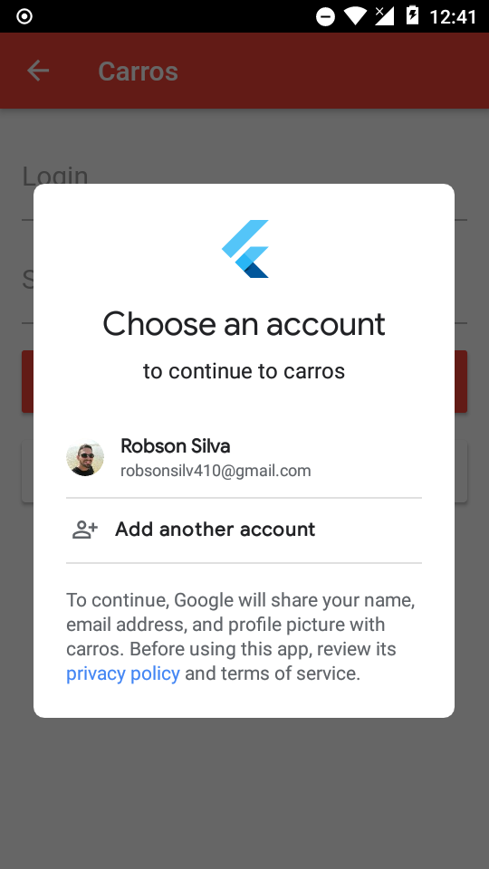

 

  

  <h3 align="center">Carros com Flutter</h3>

  

    Aplicação de gerencimento de carros desenvolvida para estudos.
  

## Tabela de conteúdos

- [Sobre o projeto](#sobre)

|                           |                           |                           |                           |                           |
| :-----------------------: | :-----------------------: | :-----------------------: | :-----------------------: | :-----------------------: |
|  |  |  |  |  |
|  |  |  |  |  |
|  |  |  |  |  |

---
